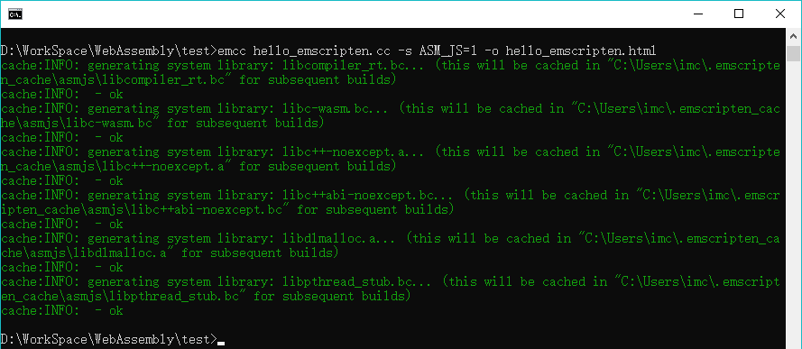
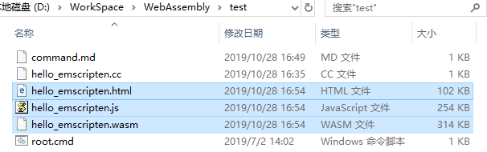
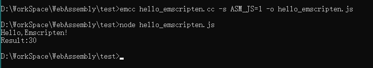
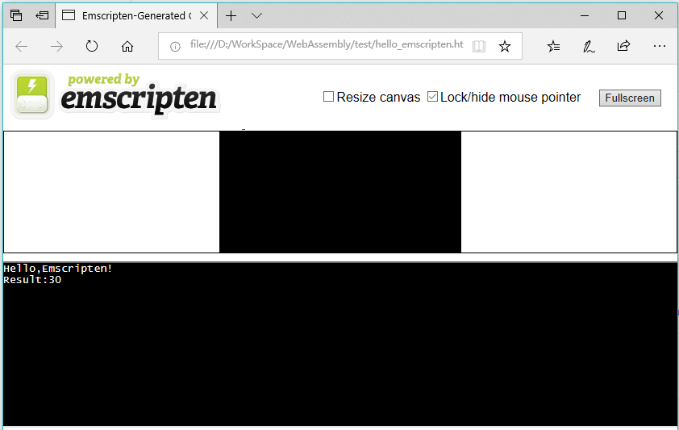
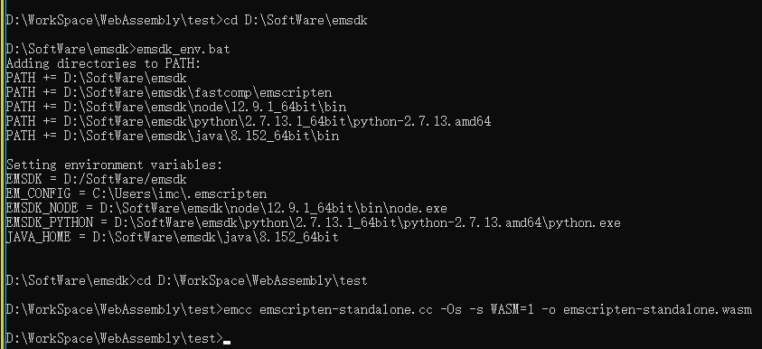
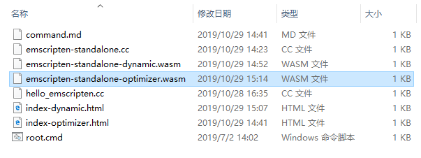
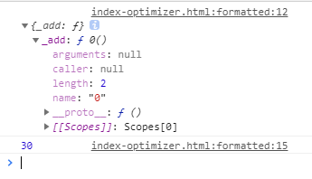

## Emscripten的安装使用教程    

> 声明在先：本文参考掘金好文 https://juejin.im/entry/5bcd43a5e51d457a502a7554    

首先想吐槽一下，《深入浅出WebAssembly》书中介绍的安装步骤有点坑，而且只针对MasOS让我感到心里苦(T_T)。
网上一堆千篇一律的文章也让人头疼，也不知道是不是真实实践得来的(+_+)?
好了不再多BB了，开始我的表演。    

### 1.安装Python并配置环境变量    

我说书里坑有一点就在这里，根本没提要安装Python。也无所谓什么版本，网上大多说因为emsdk是一组基于Python 2的脚本所以要安Python 2.7.12。
而实际情况是我装了最新版(3.7.4)也没什么问题，而且我觉得理论上可能只要高于2.7.12就可以。安装首页可以以直接勾选配置PATH就不用手动配了。
下载地址https://www.python.org/downloads/    

### 2.下载解压emsdk    

去github上下载解压一下就可以了，没什么可说的。地址https://github.com/emscripten-core/emsdk 也可以用git命令    

### 3.去emsdk下依次运行以下命令    

- 去emsdk下(我的emsdk路径D:/SoftWare/emsdk)：    
`d:`    
`cd SoftWare/emsdk`    

- 下载安装最新版sdk工具：    
`emsdk update`    
`emsdk install latest`    

书里坑第二点这里根本没提emsdk update命令。我一开始按照书上的步骤，提示我'python' 不是内部或外部命令了我才知道要安装Python。
安装完Python直接运行emsdk install latest还是不成功提示`Error: Downloading URL 'https://storage.googleapis.com/webassembly/emscripten-releases-builds/win/bc367c257409d676e71c5511383228b7aabf1689/wasm-binaries.zip': <urlopen error [WinError 10060] 
由于连接方 在一段时间后没有正确答复或连接的主机没有反应，连接尝试失败。>
  Installation failed!`我还以为是因为要翻墙，准备去找国内镜像了。
结果找到文章开头的文章，才知道原来还需要先emsdk update。
但这里也不必将emsdk替换成emsdk.bat，也没有网上说的要下一个小时，我只等了大概十分钟。我的运行截图如下：    

    

这里可以看到输出了一行`Done installing tool 'python-2.7.13.1-64bit'.`这么看来可能之前说的Python应该下2.7.13才准确吧。。。
而且就算你下的不是这个版本，这一步也会再下，所以不用太纠结版本。    

- 激活sdk    
`emsdk activate latest`    

引用下书中原文：    
> 这里的“激活”实际上就是指将当前Emscripten工具链所需要的各种环境变量信息都写入.emscripten配置文件中，以供emcc等编译器工具使用。    

我的运行截图如下：    

    

这里可以看到都配了什么东西，最后也提示了Windows用户怎样环境变量全局化，但以防潜在的副作用：
将环境变量指向了Emscripten内置的Node.js、Python、Java，若系统中安装了这些组件的其他版本，可能引发冲突。
所以还是不全局的好。不全局的弊端时以后在新建的控制台中都需要配置一次环境变量，才可使用Emscripten核心命令emcc。    

- 初始化环境变量    
`emsdk_env.bat`    

其实就是配环境变量，省的自己手动去配了。但这里Windows就不能使用source ./emsdk_env.sh了。最后可以执行emcc -v检验一下。我的运行截图如下：    

    

“纸上得来终觉浅，绝知此事要躬行”。好，到此环境已经搭建好了。

### 4.简单示例一————编译到ASM.js    

- 新建一个C文件，名为hello_emscripten.cc(我放在D:\WorkSpace\WebAssembly\test目录下)    

```
#include <iostream>

using namespace std;

int add(int x, int y){
return x + y;
}

int main(int argc, char **argv){
cout << "Hello,Emscripten!\n" << "Result:" << add(10, 20) << endl;
return 0;
}
```    

- 初始化环境变量再回到工作目录(如果本次命令窗口中已经进行或做了全局化则略过此步骤)    

`cd D:\SoftWare\emsdk`    
`emsdk_env.bat`    

`cd D:\WorkSpace\WebAssembly\test`    

- 编译到ASM.js    

`emcc hello_emscripten.cc -s ASM_JS=1 -o hello_emscripten.html`    

    
    

这里的 -o hello_emscripten.html 会同时生成同名的.html,.js和.wasm文件，也可以-o hello_emscripten.js只生成.js和.wasm文件文件。
如果没有 -o xxx.xx，则默认会自动在当前目录生成一个a.out.js文件。    

我们可以直接使用node命令执行js    

`node hello_emscripten.js`    

    

也可以在Web浏览器中运行(直接双击html文件)    

    

Emscripten会在当前html中创建两个数据输区域：顶端Canvas画布主要用于测试源代码中OpenGL相关的部分功能；底部可交互区模拟出一个只能进行数据输出的命令行控制台。    

 > ASM.js模块类型声明标识：“use asm”与“almost asm”

“use asm”告诉浏览器定义的函数内部所有代码都遵循ASM.js的语法和规则，即将其视为一个标准的ASM.js模块。这样才浏览器内部的JS引擎才会按照ASM.js模块的数据分配与编译方式来执行定义在该模块内的方法。    
而实际上，浏览器对ASM.js代码的可优化条件非常严格。一旦某些语法格式或边界条件没有满足要求，整个ASM.js代码就会直接退化为正常的JS代码，大大降低了执行效率。    
所以在Emscripten工具链中，对于一些因为含有特殊语法结构而无法被转译为标准ASM.js模块的C/C++源程序，Emscripten会将其对应的ASM.js模块类型声明标识改写为“almost asm”，以表示该ASM.js模块不可被优化。

### 4.简单示例二————连接C/C++与WebAssembly     

Emscripten无法将涉及浏览器层API的C/C++源程序(如使用了OpenGL技术)与独立的Wasm模块打包在一起。对此的解决办法是：只将不涉及浏览器层API接口，
仅具有纯计算和方法调用过程的代码打包到Wasm模块中；对于那些需要与浏览器进行交互或JS接口调用的代码，则将其按照普通的JS代码进行打包并交由浏览器执行。

  - Standalone类型    
  
  该类型的Wasm应用只适用于那些仅包含纯计算和方法调用逻辑的C/C++源程序。即源程序中不能有任何涉及需要与浏览器API进行交互、发送远程请求(HTTP/Socket)，
  以及与数据显示、输入等I/O相关的代码。构建该类型的Wasm应用时只会生成独立的Wasm二进制模块，而不会帮助构建任何用于连接该模块与上层JS环境的脚本文件。
  
   首先，新建一个C文件，名为emscripten-standalone.cc(我还是放在D:\WorkSpace\WebAssembly\test目录下)    
    
   ```
   //"胶水工具" 解决了大多数原生到Web的跨平台问题
   #include <emscripten.h>
    
   //条件编译 在C++编译器中以C语言的规则来处理代码，防止Name Mangling处理
   #ifdef __cplusplus
   extern "C"{
   #endif
    
   //利用宏防止函数被DCE
   EMSCRIPTEN_KEEPALIVE int add(int x, int y){
   return x + y;
   }
    
   #ifdef __cplusplus
   }
   #endif
   ```    
    
  构建Standalone类型的Wasm应用有两种方式：
  
   1 使用增强型优化器的方式(Optimizer)    
    `emcc emscripten-standalone.cc -Os -s WASM=1 -o emscripten-standalone-optimizer.wasm`    
    
   其中-Os参数是优化的关键，该参数告知编译器以“第4等级”的优化策略优化目标代码，进而删除其中没有被用到并且与ERE(Emscripten Runtime Environment, Emscripten运行时环境)相关的所有信息。但这种方式可能并不适用于功能较为复杂或使用了C++11及以上版本语法特性的Wasm应用。    
    
      
      
  
   接下来，给出HTML与JS脚本代码：    
   ```
   <!DOCTYPE html>
   <html>
   <head>
     <title>Emscripten - Standalone WebAssembly Module - Optimizer</title>
   </head>
   <body>
     <script type="text/javascript">
       // 远程加载wasm模块
       fetch('emscripten-standalone-optimizer.wasm').then(
         response => response.arrayBuffer()
       ).then(bytes =>
         // 没有需要向模块中导入的内容
         WebAssembly.instantiate(bytes, {})
       ).then(result => {
         // 从exports对象中获取模块对外暴露出的add方法
         const exportFuncAdd = result.instance.exports['_add'];
         // 调用add方法
         console.log(exportFuncAdd(10, 20));
       })
     </script>
   </body>
   </html>
   ```    
    
   注意，在Name Mangling特性不生效的情况下，Emscripten会给导出的函数的函数名前加上下划线做前缀，因此从exports对象中获取导出函数时需要使用“_add”.
    
   但这次因为使用了fetch远程加载，直接双击html文件打开会受到CORS限制，所以需要启服务将我们的html和wasm部署在web上。
   此处我使用wildfly进行部署，具体参照wildfly教程前6步：  https://github.com/missgentle/Q-A/tree/master/Guide/wildfly    
   
   这里我将html和wasm拷贝到本地路径D:\SoftWare\wildfly-15.0.0.Final\ux下，启动wildfly，访问http://127.0.0.1:8080/ux/index-optimizer.html 
   F12控制台输出如下：
    
       

   2 编译成动态库的方式(Dynamic Library)    
    `emcc emscripten-standalone.cc -s WASM=1 -s SIDE_MODULE=1 -o emscripten-standalone-dynamic.wasm`    

  - Dependent类型    
  `emcc dependent.cc -s WASM=1 -s 'EXTRA_EXPORTED_RUNTIME_METHODS=["ccall"]' --post-js post-script.js -o dependent.js`    


