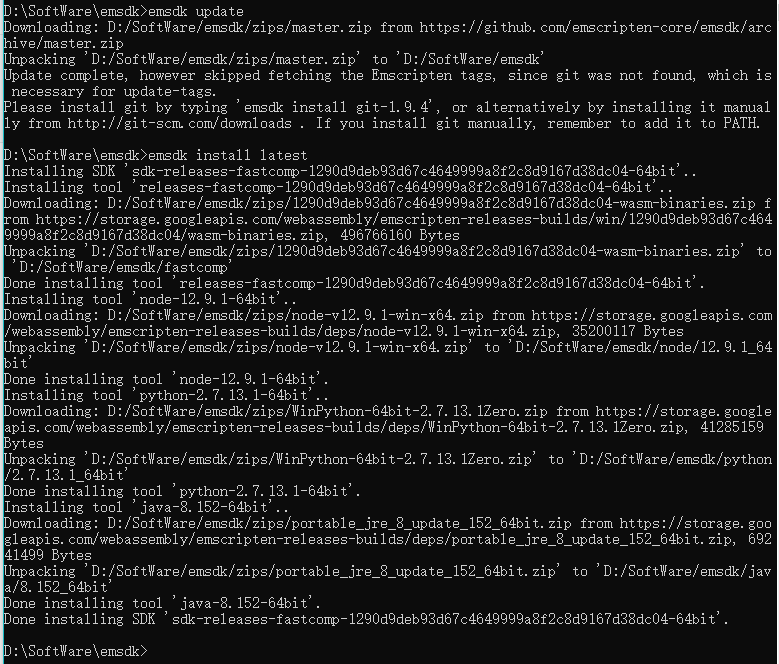
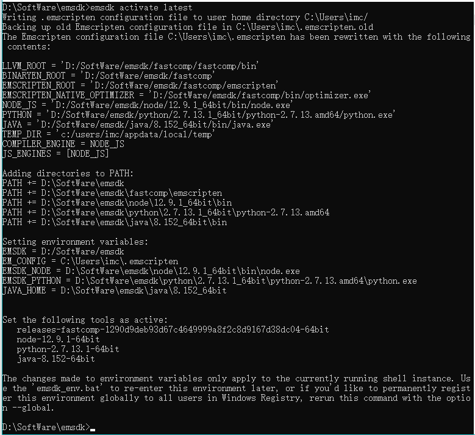
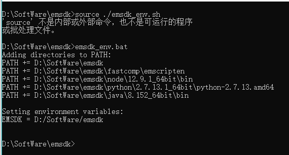

## Emscripten的安装使用教程    

> 声明在先：本文参考掘金好文 https://juejin.im/entry/5bcd43a5e51d457a502a7554    

首先想吐槽一下，《深入浅出WebAssembly》书中介绍的安装步骤有点坑，而且只针对MasOS让我感到心里苦(T_T)。
网上一堆千篇一律的文章也让人头疼，也不知道是不是真实实践得来的(+_+)?
好了不再多BB了，开始我的表演。    

### 1.安装Python并配置环境变量    

我说书里坑有一点就在这里，根本没提要安装Python。也无所谓什么版本，网上大多说因为emsdk是一组基于Python 2的脚本所以要安Python 2.7.12。
而实际情况是我装了最新版(3.7.4)也没什么问题，而且我觉得理论上可能只要高于2.7.12就可以。安装首页可以以直接勾选配置PATH就不用手动配了。
下载地址https://www.python.org/downloads/    

### 2.下载解压emsdk    

去github上下载解压一下就可以了，没什么可说的。地址https://github.com/emscripten-core/emsdk 也可以用git命令    

### 3.去emsdk下依次运行以下命令    

- 去emsdk下(我的emsdk路径D:/SoftWare/emsdk)：    
`d:`    
`cd SoftWare/emsdk`    

- 下载安装最新版sdk工具：    
`emsdk update`    
`emsdk install latest`    

书里坑第二点这里根本没提emsdk update命令。我一开始按照书上的步骤，提示我'python' 不是内部或外部命令了我才知道要安装Python。
安装完Python直接运行emsdk install latest还是不成功提示`Error: Downloading URL 'https://storage.googleapis.com/webassembly/emscripten-releases-builds/win/bc367c257409d676e71c5511383228b7aabf1689/wasm-binaries.zip': <urlopen error [WinError 10060] 
由于连接方 在一段时间后没有正确答复或连接的主机没有反应，连接尝试失败。>
  Installation failed!`我还以为是因为要翻墙，准备去找国内镜像了。
结果找到文章开头的文章，才知道原来还需要先emsdk update。
但这里也不必将emsdk替换成emsdk.bat，也没有网上说的要下一个小时，我只等了大概十分钟。我的运行截图如下：    

    

这里可以看到输出了一行`Done installing tool 'python-2.7.13.1-64bit'.`这么看来可能之前说的Python应该下2.7.13才准确吧。。。
而且就算你下的不是这个版本，这一步也会再下，所以不用太纠结版本。    

- 激活sdk    
`emsdk activate latest`    

引用下书中原文：    
> 这里的“激活”实际上就是指将当前Emscripten工具链所需要的各种环境变量信息都写入.emscripten配置文件中，以供emcc等编译器工具使用。    

我的运行截图如下：    

    

这里可以看到都配了什么东西，最后也提示了Windows用户怎样环境变量全局化，但以防潜在的副作用：
将环境变量指向了Emscripten内置的Node.js、Python、Java，若系统中安装了这些组件的其他版本，可能引发冲突。
所以还是不全局的好。    

- 初始化环境变量    
`emsdk_env.bat`    

其实就是配环境变量，省的自己手动去配了。但这里Windows就不能使用source ./emsdk_env.sh了。最后可以执行emcc -v检验一下。我的运行截图如下：    

    

“纸上得来终觉浅，绝知此事要躬行”。好，到此环境已经搭建好了。

