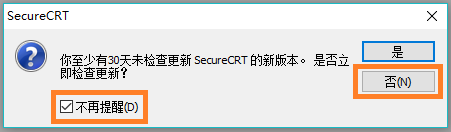
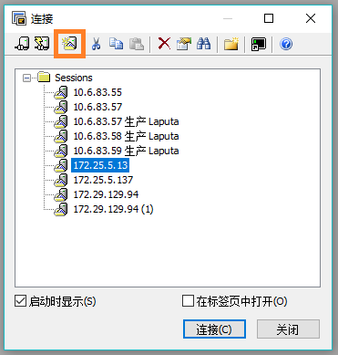
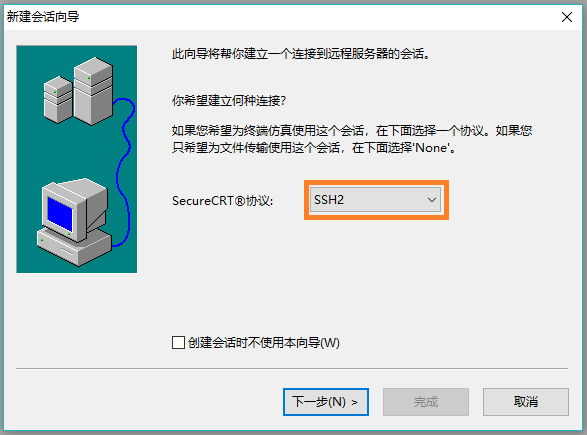
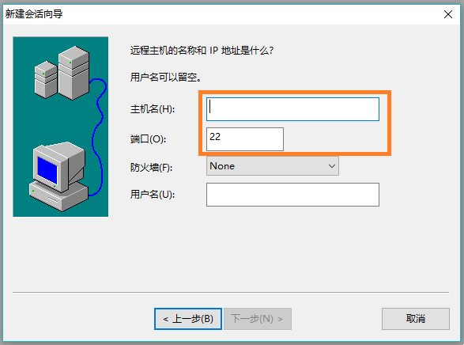
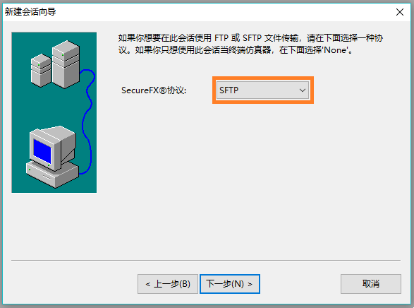
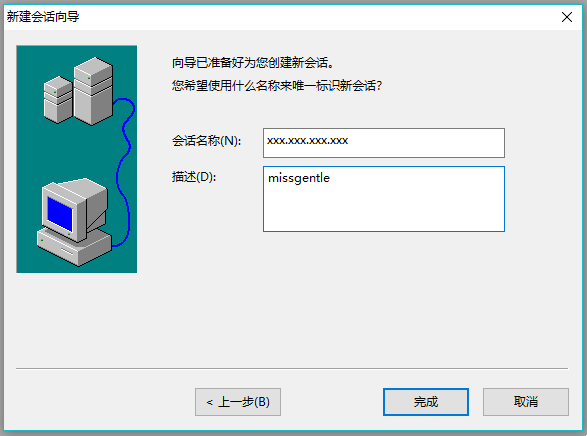
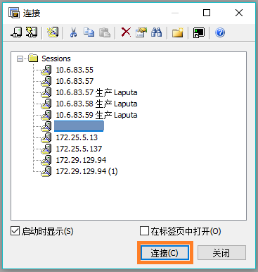
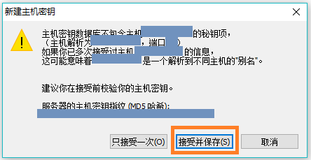
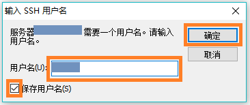
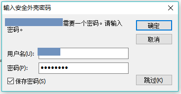

## SecureCRT绿色破解版下载&使用

> 今天又get到了新技能，nice~    
> 声明在先：参考与下载连接 https://blog.csdn.net/www1056481167/article/details/88222591    

### 1.下载解压看链接就可以了，不做无用功了

### 2.运行SecureCRTPortable.exe，第一次打开会弹一个版本检查的框，以后不要提示也不需要升级就好

### 3.版本检查的框关闭后，接着会弹出连接窗口，点新建会话

### 4.看协议需不需要改，不需要改直接下一步

### 5.主机地址(109.14.20.45)，端口号(22)填上，下一步

### 6.再看协议需不需要改，不需要改直接下一步

### 7.写个描述，完成

### 8.连接就添加上了，点连接按钮

### 9.如果弹出密钥警示框，点接受并保存

### 10.输入用户名，勾选记住，确定

### 11.输入密码，勾选记住，确定

### 12.现在就可以键入linux命令啦
