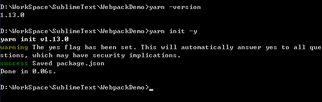
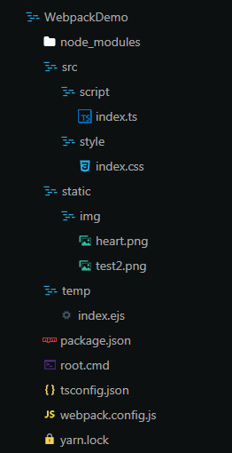
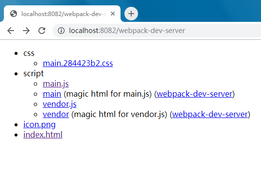

## 如何使用webpack启项目

> 在开始之前，请确保安装了 Node.js 的最新版本。

#### 1 创建项目文件夹如WebpackDemo，文件夹下创建root.cmd文件，内容如下:

```
@echo off 
set base=%~dp0
cmd /k cd /d %base%
```

此文件仅用于更加方便的打开当前路径下的命令窗口

#### 2 Sublime Text 打开文件夹WebpackDemo，右键root.cmd文件-->Open/Run

如果使用npm包管理器就在命令行窗口中键入`npm init -y`

如果使用yarn包管理器就在命令行窗口中键入`yarn init -y`



此命令将在当前路径下(WebpackDemo文件夹中)自动生成package.json文件，用于描述npm包的所有相关信息

_我的npm最近越来越不好用，所以后面我使用yarn为例，使用npm只需要将yarn命令都替换为对应的npm命令即可。
但nodejs中并没有集成yarn所以要使用yarn需要先安装，下载链接：https://yarnpkg.com/en/docs/install#windows-stable
，想省事也可以直接用npm安装yarn，请自行百度，我这里就不赘述了。但看了这里的对比感觉还是尽早投入yarn的怀抱比较好:https://www.zhihu.com/question/51502849_

#### 3 继续键入命令`yarn add webpack webpack-cli --dev`或`npm install webpack webpack-cli --save-dev`

此命令将安装最新版本的webpack和CLI(webpack-cli)，如果安装webpack4以下的特定版本，则不需安装CLI

此时可以看到有多了一个node_moudles文件夹，用于存放依赖包，
还有一个yarn.lock文件(npm对应的是package-lock.json文件)，用于记录依赖包的下载的实际版本和路径信息。

同时也会发现package.json文件多了几行：

```
"devDependencies": {
    "webpack": "^4.35.0",
    "webpack-cli": "^3.3.5"
  }
```
使用命令参数-dev添加的依赖包就会被记录在"devDependencies"字段中

#### 4 webpack不会更改代码中除import、export 语句以外的部分。如果还想使用其它ES2015特性，那还需要安装Babel转译器来帮你做浏览器兼容。

`yarn add @babel/core babel-core babel-loader babel-preset-env --dev`

然后根目录下添加.babelrc文件，内容示例如下(具体请参考：https://juejin.im/post/5c19c5e0e51d4502a232c1c6)

```
{
  "presets": ["env"]
}
```

#### 5 如果想要使用ts作为开发语言，接下来请进行以下相关操作：

 - 安装 @types/node typescript ts-node @types/webpack ts-loader 
 - 创建 tsconfig.json 文件，这里给出示例，各编译参数解释请自行查阅官文
 ```
 {
    "compilerOptions": {
        "target": "es5",
        "module": "commonjs",
        "emitDecoratorMetadata": true,
        "allowSyntheticDefaultImports": true,
        "experimentalDecorators": true,
        "outDir": "./dist/",
        "allowJs": true,
        "lib": [
            "dom",
            "es5"
        ]
    },
    "exclude": [
        "node_modules"
    ]
}

 ```
 - 稍后还要在webpack.config.js增加一些原则(第9条)
    
#### 6 如果还想要使用jQ

 - 安装 @types/jquery expose-loader：运行命令 `yarn add @types/jquery expose-loader --dev`
 - 安装 jquery ：运行命令 `yarn add jquery `
 ** 注意安装时带或不带 --dev 是有区别的，不带则安装一个要打包到生产环境的安装包，带则安装一个要打包到开发环境的安装包，安装完看看package.json文件变化就知道了 **
  - 在 tsconfig.json 文件中添加一个编译参数` "esModuleInterop": true, `或者`"allowSyntheticDefaultImports": true,`
  - 稍后还要在 webpack.config.js 增加一些原则(第9条)
  - 使用时在ts文件中`import 'jquery';`即可

#### 7 loader(模块转换器)和plugin是webpack中两个非常重要的概念：
loader用于对模块的源代码进行转换，因为webpack本身只能识别js文件，所以需要各种各样的loader来帮助webpack处理加载不同资源文件，本质是一个函数。
插件目的在于解决loader无法实现的其他事，本质是往钩子中注册回调的函数，在Webpack构建流程中的特定时机注入扩展逻辑来改变构建结果或做你想做的事。

webpack常用的loader
样式：style-loader、css-loader、less-loader、sass-loader等
文件：raw-loader、file-loader 、url-loader等
编译：babel-loader、coffee-loader 、ts-loader等
校验测试：mocha-loader、jshint-loader 、eslint-loader等

webpack常用的plugin
首先webpack内置UglifyJsPlugin，压缩和混淆代码
webpack内置CommonsChunkPlugin，提高打包效率，将第三方库和业务代码分开打包
html-webpack-plugin可以根据模板自动生成html代码，并自动引用css和js文件
HotModuleReplacementPlugin 热更新
optimize-css-assets-webpack-plugin 不同组件中重复的css可以快速去重

所以现在让我们一口气安装一大波loader和插件(当然也可以需要的时候再逐个安装)：

`yarn add css-loader html-loader html-webpack-plugin mini-css-extract-plugin url-loader --dev`

_以上提及的所有依赖包我的经验是：不管用不用，反正先都装上也没坏处，因为就算装了只要没有使用，webpack是不会打包进去的。_

#### 8 构造项目结构

做完以上准备工作，终于可以着手构建项目了，本例项目结构如图



#### 9 根目录下创建 webpack 的配置文件：webpack.config.js 或 webpack.config.ts(如果有上述5的操作的话)

在 webpack 4 中，可以无须任何配置使用。配置文件比在终端(terminal)中手动输入大量命令(使用 CLI 选项方式)要高效的多。我们可以通过配置方式指定 loader 规则(loader rules)、插件(plugins)、解析选项(resolve options)，以及许多其他增强功能。这里以js为例：

```
const path = require('path');
const webpack = require('webpack');
const CleanWebpackPlugin = require('clean-webpack-plugin');
const HtmlWebpackPlugin = require('html-webpack-plugin');
const MiniCssExtractPlugin = require("mini-css-extract-plugin");

module.exports = {
  mode: 'development',  //webpack4必须要指定的参数，'development' or 'production'
  entry: './src/script/index.ts',  //入口，可以是包含多个入口的对象
  output: {  //出口只能有一个
    filename: 'script/[name].js',  //输出的文件名
    //dist作为构建过程产生的代码最小化和优化后的“输出”目录最终将在浏览器中加载
    path: path.resolve(__dirname, '/dist')  
  },
  optimization: {
    splitChunks: {
      cacheGroups: {
        vendor: {
          test: /[\\/]node_modules[\\/]/,
          name: 'vendor',
          chunks: 'all'
        }
      }
    }
  },
  devServer: {
    contentBase: './dist',
    disableHostCheck: true,
    host: '0.0.0.0',
    port: '8082'
  },
  plugins: [
  	new HtmlWebpackPlugin({ 
        title: 'Webpack WebApp',
        filename: 'index.html',
        favicon: './static/img/icon.png',
        template: 'temp/index.ejs',
        chunks: [ 'main', 'vendor'],
    }),
    new webpack.HashedModuleIdsPlugin(),
    new webpack.ProvidePlugin({}),
    new MiniCssExtractPlugin({
      filename: 'css/[name].[hash:8].css',
      chunkFilename: "[id].css"
    })
  ],
  module: {
    //loader规则。webpack 根据正则表达式，来确定应该查找哪些文件，并将其提供给指定的 loader。
    rules: [  
      {
        test: /\.css$/,
        use: [
          {
            loader: MiniCssExtractPlugin.loader,
            options: {
              publicPath: '../../' 
            }
          }, 
          'css-loader'
        ]
      },

      {
        test: /\.(png|svg|gif|jpg|woff|woff2|eot|ttf|otf)(\?v=[0-9]\.[0-9]\.[0-9])?$/,
        exclude: /node_modules/,
        use: [
          {
              loader: "file-loader",
              options: {
                name: "[name].[hash:5].[ext]",
                limit: 1024,
                outputPath: "img",
                publicPath: "../"
              } 
          }
        ]
      },
      {
        test: /\.ts(x?)$/,
        exclude: /node_modules/,
        use: [
          'babel-loader',
          'ts-loader'
        ]
      },
      {
        test: /\.js(x?)$/,
        exclude: /node_modules/,
        use: [
          'babel-loader'
        ]
      },
      {
        test: require.resolve('jquery'),
          use: [{
            loader: 'expose-loader',
            options: 'jQuery'
          },
          {
            loader: 'expose-loader',
             options: '$'
          }
        ]
      }
    ]
  },
  resolve: {
      extensions: [".js", ".ts"],
      alias: {
        '@': path.join(__dirname, "src"),
      }
  }
};
```

配置中存在这一段：

```
devServer: {
    contentBase: './dist',
    disableHostCheck: true,
    host: '0.0.0.0',
    port: '8082'
  },
```
这里需要安装 webpack-dev-server 目的是为了实现实时重新加载，在 localhost:8082 下建立服务，并将output： dist 目录下的文件，作为可访问文件。

loader原则需要则添加，不需要则去掉，比如若使用jq，则rules中就需要这一段：

```
{
     test: require.resolve('jquery'),
     use: [{
            loader: 'expose-loader',
            options: 'jQuery'
          },
          {
            loader: 'expose-loader',
             options: '$'
          }
     ]
}
```

实际顺序应该是你的项目中除了js文件外还需要打包什么类型的文件，就yarn add对应需要的loader协助转译为webpack能够处理的模块，并添加对应的rules告诉webpack用哪些loader，按何种顺序来处理非js类型的文件。

loader处理顺序是从下到上，从右到左的，如
```
{
     test: /\.ts(x?)$/,
     exclude: /node_modules/,
     use: [
          'babel-loader',
          'ts-loader'
     ]
},
```
意思是当遇到ts或tsx文件时(其中不包括node_modules文件夹下的，因为node_modules文件夹下的所有内容会单独打包到一个叫vendor的chunk块中)，先使用ts-loader处理生成es5(如果tsconfig.json中配置"target": "es5"的话)，输出再交给babel-loader做浏览器兼容，最后交给webpack打包。

#### 10 添加 script 脚本
用 CLI 这种方式来运行本地的 webpack 不是特别方便，我们可以设置一个快捷方式。在 package.json 文件中添加一个 script 脚本，可以直接运行开发服务器(dev server)：

```
{
  "name": "WebpackDemo",
  "version": "1.0.0",
  "main": "index.ts",
  "scripts": {
    "start": "webpack-dev-server --config webpack.config.js",
  },
  "license": "MIT",
  "devDependencies": {
    "@babel/core": "^7.4.5",
    "@types/jquery": "^3.3.30",
    "@types/node": "^12.0.10",
    "@types/webpack": "^4.4.34",
    "babel-core": "^6.26.3",
    "babel-loader": "^8.0.6",
    "babel-preset-env": "^1.7.0",
    "clean-webpack-plugin": "^3.0.0",
    "css-loader": "^3.0.0",
    "expose-loader": "^0.7.5",
    "file-loader": "^4.0.0",
    "html-loader": "^0.5.5",
    "html-webpack-plugin": "^3.2.0",
    "mini-css-extract-plugin": "^0.7.0",
    "postcss-loader": "^3.0.0",
    "ts-loader": "^6.0.4",
    "ts-node": "^8.3.0",
    "typescript": "^3.5.2",
    "url-loader": "^2.0.1",
    "webpack": "^4.35.0",
    "webpack-cli": "^3.3.5",
    "webpack-dev-server": "^3.7.2"
  },
  "dependencies": {
    "jquery": "^3.4.1"
  }
}
  ```
  
  这样之后就可以在cmd中键入 `yarn start` 启动，而不需要 `webpack-dev-server --config webpack.config.js`了
  
  _如果 webpack.config.js 存在，则 webpack 命令将默认选择使用它。使用 --config 选项只是向你表明，可以传递任何名称的配置文件。_
  
  浏览器打开 http://localhost:8082  就可以看到你的页面啦~
  
  浏览器打开 http://localhost:8082/webpack-dev-server  还可以看到你最终打包出来的项目结构
  
      
  
  这里我之前一直很困惑的一点：为什么打包出来的js文件叫main而不是index，    
  后来知道原来`entry: './src/script/index.ts'`是单入口的一种缩写，具体内容如下：    
```
entry: {
    main: './src/script/index.ts'
}
```
所以
```
output: {
    filename: 'script/[name].js',
    path: path.resolve(__dirname, '/dist')
}
```
这里的[name]取值就是main。这也直接导致了new HtmlWebpackPlugin时chunks: [ 'main', 'vendor'],的取值。
  
  最后，为了保证每次webpack-dev-server重启都会先清除之前打包的旧文件，可以看到我add了一个插件clean-webpack-plugin，并在webpack.config.js文件最上面有：
  
  `const CleanWebpackPlugin = require('clean-webpack-plugin');`


