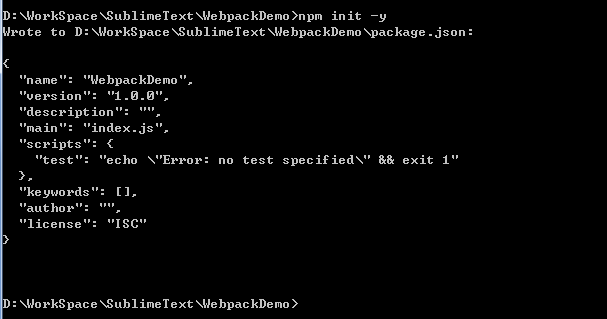

## 如何使用webpack启项目

- 创建项目文件夹如WebpackDemo，文件夹下创建root.cmd文件，内容如下:

```
@echo off 
set base=%~dp0
cmd /k cd /d %base%
```

此文件仅用于更加方便的打开当前路径下的命令窗口

- Sublime Text 打开文件夹WebpackDemo，右键root.cmd文件-->Open/Run，在命令行窗口中键入npm init -y

此命令将在当前路径下(WebpackDemo文件夹中)自动创建package.json文件


